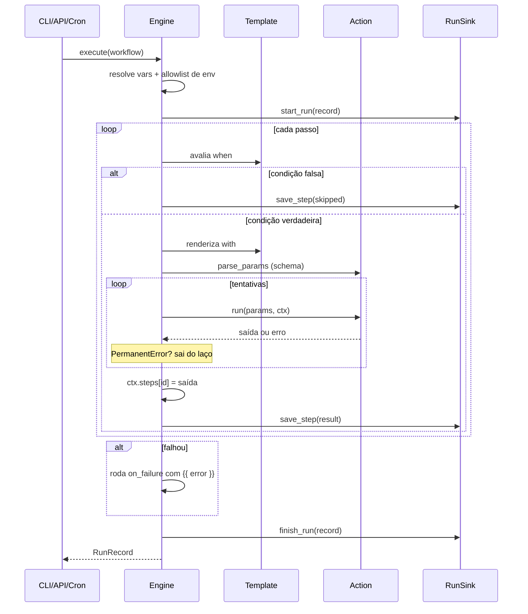

# Arquitetura

Como o Fluxor é construído por dentro, por que cada decisão foi tomada e o que
foi deliberadamente deixado de fora.

---

## Visão geral

O Fluxor tem três camadas, e a dependência aponta sempre para dentro:

```
Entradas          CLI · Agendador · API REST · Webhook
                              ↓
Núcleo            Loader → Engine → Registry
                       (Templates · Retry · Contexto)
                              ↓
Saídas            Actions · RunSink (banco) · Dashboard
```

O núcleo não conhece FastAPI, SQLAlchemy, Typer nem APScheduler. Ele conhece
Pydantic, Jinja e um `Protocol` de três métodos. Por isso o motor pode ser usado
como biblioteca pura, sem banco e sem servidor:

```python
record = await Engine().execute(workflow)
```

---

## Mapa dos módulos

| Módulo | Responsabilidade | Depende de |
|---|---|---|
| `models.py` | Schema do workflow em Pydantic | — |
| `loader.py` | YAML → `Workflow` validado | `models`, `registry` |
| `context.py` | Estado vivo da execução | — |
| `template.py` | Renderização Jinja em sandbox | `exceptions` |
| `retry.py` | Política de backoff | `models`, `exceptions` |
| `registry.py` | Descoberta e registro de actions | `exceptions` |
| `engine.py` | Orquestração | todos os acima |
| `actions/` | Trabalho de verdade (HTTP, disco, notificação) | `base`, `registry` |
| `storage/` | Persistência do histórico | `engine` (só os tipos) |
| `scheduler.py` | Cron | `engine`, `loader` |
| `api/` | REST + dashboard | `engine`, `storage` |
| `cli.py` | Terminal | tudo |

Não há dependência circular: `engine` importa `storage` apenas para tipos, e
`storage` implementa um protocolo definido em `engine`.

---

## O ciclo de uma execução



---

## Decisões e o porquê

### 1. Erro permanente contra erro transitório

**Problema.** Uma política de retry ingênua tenta de novo qualquer exceção. Isso
transforma um 404 em três requisições, um campo obrigatório faltando em três
validações idênticas, e mascara o erro real atrás de um atraso.

**Solução.** Uma hierarquia de exceções onde `PermanentError` significa "tentar
de novo daria exatamente o mesmo resultado". O laço de retry sai imediatamente
ao ver essa classe.

```python
except (PermanentError, asyncio.CancelledError):
    raise
except Exception as exc:
    # aqui, e só aqui, a política de retry se aplica
```

**Consequência.** Quem conhece o protocolo é quem classifica. A action HTTP sabe
que 4xx (exceto 408/425/429) é permanente e 5xx não é; `retry.py` não precisa
saber o que é HTTP. Uma action de banco de dados poderia classificar "violação
de constraint" como permanente e "deadlock" como transitório, sem tocar no motor.

### 2. Tipagem nativa nos templates

**Problema.** Renderizar `{{ vars.teto }}` como string faz `when: "preco > teto"`
comparar texto. E `"9" > "10"` é verdadeiro em comparação de string.

**Solução.** Se a string é *apenas* uma expressão, o valor sai com o tipo
original. Se tem texto misturado, sai como string.

**A parte interessante.** A primeira versão usava regex:

```python
FULL_EXPRESSION_RE = re.compile(r"^\s*\{\{(.+?)\}\}\s*$", re.DOTALL)
```

Parece correto e passou nos primeiros testes. Mas o `.+?` é preguiçoso *com
backtracking*: em `"{{ a }}:{{ b }}"`, ele não consegue casar parando no
primeiro `}}` (o `$` não bate), então expande até o último — e captura
`a }}:{{ b` como se fosse uma expressão só. O bug apareceu num teste de
`foreach` com `"{{ index }}:{{ item }}"`.

A versão atual pergunta ao parser do Jinja quantos nós de saída o template tem:

```python
tree = environment.parse(source)
if len(tree.body) == 1 and isinstance(tree.body[0], nodes.Output):
    outputs = tree.body[0].nodes
    if len(outputs) == 1 and not isinstance(outputs[0], nodes.TemplateData):
        ...  # é uma expressão única
```

Sem cantos escuros, e ainda lida corretamente com `{{ {"a": {"b": 1}} }}`, onde
as chaves aninhadas produzem um `}}` no meio da expressão.

**Lição.** Quando existe um parser de verdade para a linguagem, use o parser.

### 3. Allowlist de ambiente

**Problema.** Expor `os.environ` inteiro ao template significa que qualquer
workflow lê qualquer segredo do processo.

**Solução.** O workflow declara o que precisa:

```yaml
env: [TELEGRAM_BOT_TOKEN]
```

e o motor monta o dicionário `env` só com esses nomes. O que não foi declarado
não existe no contexto — não é escondido, é ausente.

**Trade-off aceito.** Duas linhas a mais de YAML. Em troca, a superfície de um
YAML malicioso ou de um erro de digitação fica limitada ao que o autor
conscientemente pediu, e o arquivo documenta seus próprios requisitos.

### 4. Templates em sandbox

`SandboxedEnvironment` do Jinja bloqueia acesso a atributos internos. Sem ele,
`{{ ''.__class__.__mro__[1].__subclasses__() }}` é o primeiro passo de um
caminho conhecido até execução arbitrária de código.

Como o YAML pode vir de um PR, de um usuário do dashboard ou de um arquivo que
alguém copiou da internet, o sandbox não é paranoia — é o mínimo. Há teste
cobrindo exatamente essa tentativa de fuga.

### 5. `RunSink` como Protocol

```python
@runtime_checkable
class RunSink(Protocol):
    async def start_run(self, record: RunRecord) -> None: ...
    async def save_step(self, run_id: str, index: int, result: StepResult) -> None: ...
    async def finish_run(self, record: RunRecord) -> None: ...
```

**Por quê.** Inversão de dependência de verdade, não por cerimônia. Três ganhos
concretos:

1. O motor roda sem banco nenhum (`Engine()` sem argumentos).
2. Trocar SQLite por Postgres, Redis ou JSONL não muda uma linha do engine.
3. Testar o motor não exige banco — um objeto com três métodos basta, e é
   exatamente o que `test_engine.py` faz.

**E mais um detalhe:** toda chamada ao sink é envolvida em try/except.

```python
except Exception as exc:
    self.log.warning("sink_falhou", metodo=method, error=str(exc))
```

Telemetria é *best-effort*. Banco fora do ar não pode derrubar o backup que
estava rodando. Perder o registro de uma execução é ruim; perder a execução é
pior.

### 6. Falha é dado, não crash

`Engine.execute` **nunca** levanta por falha de passo. Devolve um `RunRecord`
com `status=failed` e a mensagem.

**Por quê.** Cada chamador quer uma coisa diferente:

- a CLI quer imprimir o erro bonito e sair com exit code 1;
- o agendador quer logar e continuar vivo para o próximo horário;
- a API quer devolver 200 com `"status": "failed"` no corpo (o disparo
  funcionou — quem falhou foi o workflow).

Se o motor levantasse, os três precisariam do mesmo try/except, e um deles
esqueceria.

### 7. Assíncrono do início ao fim

Automação é trabalho de I/O: esperar rede, esperar disco, esperar SMTP. Com
`asyncio`, um `foreach` sobre 20 URLs leva o tempo da mais lenta, não a soma das
vinte — e o dashboard continua respondendo enquanto isso.

**A disciplina que isso exige:** qualquer chamada bloqueante trava *todos* os
workflows. Por isso `smtplib`, leitura de arquivo e `csv` vão para
`asyncio.to_thread`. É um custo real de atenção, pago conscientemente.

O paralelismo do `foreach` é limitado por semáforo
(`FLUXOR_FOREACH_CONCURRENCY`): uma lista de 500 itens não deve virar 500
conexões simultâneas e um IP banido.

### 8. `extra="forbid"` em todo lugar

Todos os modelos Pydantic — workflow, passo, retry, entrada de action —
rejeitam campos desconhecidos.

**Por quê.** O modo de falha de uma ferramenta declarativa não é o erro
barulhento; é o campo ignorado em silêncio. `descripton` em vez de
`description` precisa parar o carregamento, não passar despercebido até alguém
notar que a documentação sumiu.

### 9. Registry por decorator + entry points

Actions embutidas são descobertas varrendo o pacote `fluxor.actions`; actions de
terceiros entram por entry point:

```toml
[project.entry-points."fluxor.actions"]
minhas = "meu_pacote.actions"
```

**Por quê.** Sem isso, cada integração nova (Slack, Notion, S3, Sheets) precisa
entrar no repositório principal, e o projeto vira um monólito de dependências
que ninguém usa por inteiro. Com entry points, o ecossistema cresce sem que o
núcleo cresça.

Plugin quebrado registra warning e é ignorado — um pacote mal instalado não
derruba o motor.

### 10. Persistência com saída truncada

A saída de um passo é gravada como JSON, cortada em `FLUXOR_MAX_OUTPUT_BYTES`
(64 KB por padrão):

```json
{"_truncated": true, "_bytes": 2100000, "preview": "<!DOCTYPE html>..."}
```

**Por quê.** Um `http.get` numa página comum devolve megabytes. Gravar isso a
cada execução transforma o histórico numa bomba de disco. Durante a execução o
valor completo circula normalmente entre os passos; o que é truncado é apenas o
registro histórico.

### 11. SQLite com WAL

```sql
PRAGMA journal_mode=WAL;
PRAGMA foreign_keys=ON;
PRAGMA busy_timeout=5000;
```

Sem WAL, rodar `fluxor run` no terminal enquanto o dashboard consulta o banco
resulta em `database is locked`. Com WAL, leitura e escrita convivem.

`foreign_keys=ON` porque o SQLite ignora foreign keys por padrão — e sem isso a
regra `ON DELETE CASCADE` de `step_runs` seria decorativa.

### 12. Dashboard sem build

HTML, CSS e JavaScript puros. Sem npm, sem bundler, sem `node_modules`.

**Por quê.** O dashboard tem quatro telas e um gráfico. Uma cadeia de build
traria 300 MB de dependências, uma etapa a mais no CI e uma segunda linguagem no
repositório — para renderizar quatro cartões e uma tabela. O gráfico é SVG
gerado à mão, com `<title>` em cada barra para o tooltip nativo.

**Quando essa decisão deixa de valer:** se o dashboard ganhar edição de
workflow, formulários complexos ou estado compartilhado entre telas. Aí um
framework passa a se pagar.

---

## O que ficou de fora, e por quê

| Não tem | Por quê |
|---|---|
| **Grafo de dependências entre passos** | Execução linear cobre a maioria dos casos e é infinitamente mais fácil de depurar. Um DAG é a evolução natural, mas complica o modelo mental; está no roadmap. |
| **Fila distribuída (Celery/RQ)** | Um agendador de processo único resolve até um volume alto. Introduzir broker significa mais uma peça para operar e monitorar. A troca vale quando houver necessidade real de escala horizontal. |
| **Autenticação no dashboard** | Autenticação feita pela metade é pior que nenhuma. A recomendação é explícita: proxy autenticado, VPN ou Basic Auth do Nginx. Está documentado no checklist de produção. |
| **Retomada a partir do passo que falhou** | Exige que toda action seja idempotente — uma promessa que o Fluxor não pode fazer pelos plugins de terceiros. |
| **Interface de edição de workflow** | O YAML mora no git, com histórico, revisão e rollback. Editar pela web enfraqueceria isso. |

---

## Testes

169 testes, 91% de cobertura. A escolha de *o que* testar seguiu uma regra: cada
teste cobre um comportamento que, se quebrar, causa um bug real.

| Arquivo | Foco |
|---|---|
| `test_template.py` | Tipagem nativa, filtros pt-BR, sandbox, regressão do bug de regex |
| `test_retry.py` | Curvas de backoff, jitter dentro da faixa, erro permanente sem repetição |
| `test_models_loader.py` | Schema, cron, ids reservados, nomes duplicados, exemplos versionados |
| `test_engine.py` | Encadeamento, `when`, `foreach` concorrente, timeouts, `on_failure`, sink |
| `test_actions.py` | Cada action; HTTP com `respx`, sem sair para a internet |
| `test_storage_api_cli.py` | Banco, endpoints HTTP, exit codes da CLI |

Alguns testes que valem ser destacados:

- **`test_sink_quebrado_nao_derruba_a_execucao`** — um sink que levanta em todos
  os métodos; a execução precisa terminar com sucesso mesmo assim.
- **`test_preserva_a_ordem_de_entrada`** — `foreach` com 10 itens concorrentes;
  a saída tem que sair na ordem da entrada.
- **`test_passo_pulado_nao_publica_saida`** — depender de um passo pulado precisa
  falhar de forma clara, não silenciosa.
- **`test_saida_gigante_e_truncada`** — 50 KB de saída circulam inteiros durante
  a execução e chegam cortados ao banco.
- **`test_sandbox_bloqueia_acesso_a_internos`** — a fuga clássica de template.
- **`test_todos_os_exemplos_sao_validos`** — os exemplos do repositório são
  validados no CI. Documentação que quebra é pior que documentação ausente.

---

## Números

| | |
|---|---|
| Módulos de origem | 29 |
| Actions embutidas | 23 |
| Testes | 169 |
| Cobertura | 91% |
| Dependências de produção | 16 |
| Dependências JavaScript | 0 |
