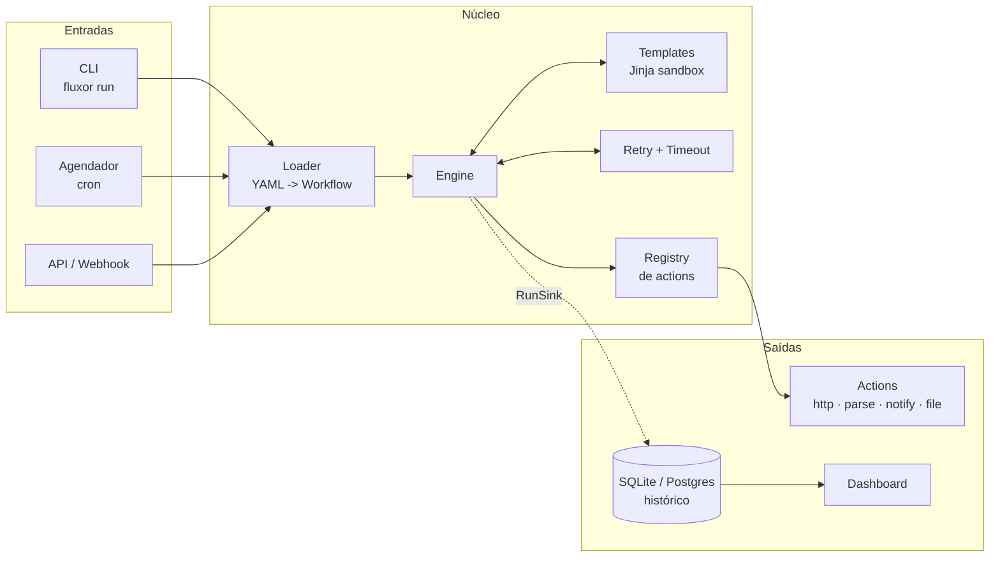

<div align="center">

# ⚡ Fluxor

**Motor de automações declarativas.** Você descreve o fluxo em YAML — o Fluxor executa, tenta de novo quando falha, guarda o histórico e mostra tudo num painel.

[](https://github.com/NeithanDev-Arch/fluxor/actions/workflows/ci.yml)
[](https://www.python.org)
[](https://github.com/astral-sh/ruff)
[](https://mypy-lang.org/)
[](#qualidade)
[](LICENSE)

[Guia completo](GUIA.md) · [Arquitetura](ARQUITETURA.md) · [Como contribuir](CONTRIBUTING.md)

</div>

---

## O problema

Toda automação começa como um script de 40 linhas que roda no cron. Aí a API começa a dar timeout e você adiciona retry. Depois quer saber se rodou ontem e adiciona log. Depois quer ser avisado quando falha. Seis meses depois são doze scripts, cada um com a sua própria versão meia-boca de retry, log e alerta, e ninguém sabe qual rodou pela última vez.

O Fluxor resolve isso uma vez só. Você escreve **o que** quer fazer; retry, timeout, agendamento, histórico e observabilidade vêm de graça.

```yaml
name: monitor-preco
description: Acompanha o preço de um produto e avisa quando cai

trigger:
  type: schedule
  cron: "0 */6 * * *"          # a cada 6 horas

env: [TELEGRAM_BOT_TOKEN, TELEGRAM_CHAT_ID]   # allowlist explícita de segredos

vars:
  url: https://books.toscrape.com/catalogue/a-light-in-the-attic_1000/index.html
  teto: 55.0

steps:
  - id: pagina
    use: http.get
    with: { url: "{{ vars.url }}" }
    retry: { attempts: 3, backoff: exponential }   # 4xx não repete, 5xx repete

  - id: preco_texto
    use: parse.css
    with:
      html: "{{ steps.pagina.text }}"
      selector: p.price_color
      first: true
      required: true             # site mudou de layout? falha alto, não silencioso

  - id: preco
    use: flow.set
    with:
      values:
        valor: "{{ steps.preco_texto | to_number }}"   # "£51.77" -> 51.77

  - id: alerta
    use: notify.telegram
    when: "steps.preco.valor <= vars.teto"             # comparação numérica de verdade
    with:
      token: "{{ env.TELEGRAM_BOT_TOKEN }}"
      chat_id: "{{ env.TELEGRAM_CHAT_ID }}"
      text: "Preço caiu para {{ steps.preco_texto }}"

on_failure:                                            # compensação quando quebra
  - id: registrar
    use: notify.log
    with: { level: error, message: "falhou: {{ error }}" }
```

```console
$ fluxor run monitor-preco
  ✔ pagina        http.get         214ms
  ✔ preco_texto   parse.css          3ms
  ✔ preco         flow.set           1ms
  ⊘ alerta        notify.telegram    0ms (when: steps.preco.valor <= vars.teto)
SUCCESS  3 ok · 0 falhas · 1 pulados · 231ms
```

---

## O que você ganha

| | |
|---|---|
| **Workflows em YAML** | Schema validado com Pydantic. Chave digitada errado vira erro apontando a linha, não comportamento silencioso. |
| **23 actions embutidas** | HTTP, scraping CSS, JSON, regex, transformações, arquivos, CSV, shell, e-mail, Telegram, Discord, webhooks. |
| **Retry que entende a falha** | 4xx não é retentado (não vai melhorar), 5xx e 429 são. Backoff fixo, linear ou exponencial, com jitter. |
| **Paralelismo com `foreach`** | Um passo, N itens, execução concorrente com limite configurável. 4 cidades em 1,1 s em vez de 4,4 s. |
| **Agendador** | Cron por workflow, com fuso. Sem execução sobreposta, sem enxurrada de disparos atrasados. |
| **Dashboard + API REST** | Histórico, métricas, disparo manual, detalhe passo a passo. Sem build, sem `node_modules`. |
| **Templates seguros** | Jinja2 em sandbox, tipagem nativa preservada, allowlist explícita de variáveis de ambiente. |
| **Observável** | Log estruturado (JSON em produção) e toda execução gravada em banco, passo a passo. |
| **Extensível** | Uma action nova é uma classe. Pacotes de terceiros entram por entry point, sem fork. |

---

## Comece em 60 segundos

```bash
git clone https://github.com/NeithanDev-Arch/fluxor.git
cd fluxor

python -m venv .venv
source .venv/bin/activate        # Windows: .venv\Scripts\activate
pip install -e ".[dev]"

fluxor run examples/hello-mundo.yaml     # roda offline, sem configurar nada
```

Depois disso:

```bash
fluxor list                    # workflows disponíveis
fluxor actions                 # catálogo de actions
fluxor run cotacao-dolar       # busca o dólar de verdade e grava em CSV
fluxor serve                   # dashboard em http://localhost:8000
```

Ou direto no Docker:

```bash
docker compose up -d           # dashboard + agendador em http://localhost:8000
```

O [**GUIA.md**](GUIA.md) é o passo a passo completo — instalação, referência do YAML, todas as actions, filtros, CLI, API, agendamento, deploy e diagnóstico de problemas.

---

## Dashboard

Painel em HTML, CSS e JavaScript puros — sem framework, sem build. Métricas do período, execuções por dia, lista de workflows com botão de disparo e um painel lateral com o detalhe de cada passo (saída, tentativas, erro).

> **Capture o seu print:** rode `fluxor serve`, abra `http://localhost:8000`,
> execute alguns workflows para popular o gráfico e salve a imagem em
> `docs/dashboard.png`. Depois troque este bloco por
> ``. Um GIF de 10 segundos mostrando um
> workflow rodando vale mais que dois parágrafos de README.

---

## Como funciona



Para cada passo, o motor faz sempre a mesma sequência: avalia `when` → expande `foreach` → renderiza o `with` → valida contra o schema da action → executa com retry e timeout → registra o resultado. A saída de um passo fica disponível como `{{ steps.<id> }}` para todos os seguintes.

O detalhamento de cada decisão está em [**ARQUITETURA.md**](ARQUITETURA.md).

---

## Decisões de engenharia

As que mais mudaram o resultado final:

**Erro permanente ≠ erro transitório.** Um 404 continuará 404 na terceira tentativa; um 503 costuma passar. Erros que herdam de `PermanentError` pulam a política de retry por completo. A política não sabe nada sobre HTTP — quem classifica é quem conhece o protocolo.

**Tipagem nativa nos templates.** Uma string que é *apenas* uma expressão preserva o tipo: `"{{ vars.teto }}"` devolve `2500` (int), enquanto `"Teto: {{ vars.teto }}"` devolve texto. Sem isso, todo `when` numérico viraria comparação de string — e `"9" > "10"` é verdadeiro em string. A detecção usa a árvore sintática do Jinja, não regex; [a versão com regex tinha um bug real de backtracking](src/fluxor/template.py) que confundia `{{ a }}:{{ b }}` com uma expressão só.

**Allowlist de variáveis de ambiente.** O workflow declara `env: [TELEGRAM_BOT_TOKEN]` e só isso fica visível no template. Um YAML malicioso não alcança `AWS_SECRET_ACCESS_KEY` porque ela simplesmente não está no contexto.

**Templates em sandbox.** `SandboxedEnvironment` bloqueia `{{ ''.__class__.__mro__ }}` — o caminho clássico para escapar de um template e chegar em execução arbitrária. Há teste para isso.

**O motor não conhece o banco.** Ele fala com um `Protocol` de três métodos (`RunSink`). Trocar SQLite por Postgres, Redis ou um arquivo JSONL não encosta em uma linha do engine — e a persistência é *best-effort*: banco fora do ar registra um warning, não derruba a automação que estava rodando.

**Falha é dado, não crash.** `Engine.execute` nunca levanta por falha de passo: devolve um registro com `status=failed` e a mensagem. Quem chama decide — a CLI vira exit code 1, o agendador loga e segue vivo para o próximo horário.

**`shell.run` seguro por padrão.** Recebe lista de argumentos e executa sem shell. `shell: true` existe, é opt-in, e está documentado com o motivo do cuidado.

---

## Catálogo de actions

```bash
fluxor actions              # lista tudo
fluxor actions http.get     # parâmetros, tipos, obrigatoriedade e descrição
```

| Namespace | Actions |
|---|---|
| **http** | `http.get` · `http.post` · `http.request` |
| **parse** | `parse.css` · `parse.json` · `parse.regex` |
| **transform** | `transform.map` · `transform.filter` · `transform.sort` · `transform.unique` · `transform.merge` · `transform.template` |
| **flow** | `flow.set` · `flow.sleep` · `flow.assert` · `flow.fail` |
| **file** | `file.read` · `file.write` · `file.csv_append` |
| **notify** | `notify.log` · `notify.telegram` · `notify.discord` · `notify.webhook` · `notify.email` |
| **shell** | `shell.run` |

Criar a sua leva uns 20 minutos — o passo a passo está em [CONTRIBUTING.md](CONTRIBUTING.md).

---

## Exemplos inclusos

Todos rodam de verdade; nenhum exige cadastro em nada.

| Arquivo | O que demonstra |
|---|---|
| [`hello-mundo.yaml`](examples/hello-mundo.yaml) | Primeiro contato. Roda offline. `vars`, encadeamento, laço e passo condicional. |
| [`cotacao-dolar.yaml`](examples/cotacao-dolar.yaml) | API pública, retry exponencial, histórico em CSV, alerta condicional. |
| [`clima-diario.yaml`](examples/clima-diario.yaml) | `foreach` com 4 requisições em paralelo e boletim montado com Jinja. |
| [`github-radar.yaml`](examples/github-radar.yaml) | Série temporal de métricas de repositórios; expressão que devolve dicionário. |
| [`monitor-preco.yaml`](examples/monitor-preco.yaml) | Scraping + alerta no Telegram + `on_failure`, com barreira de sanidade. |
| [`deploy-webhook.yaml`](examples/deploy-webhook.yaml) | Gatilho externo por HTTP com token e execução de comando local. |

---

## Qualidade

```bash
ruff check src tests      # lint
ruff format --check       # formatação
mypy                      # tipos
pytest --cov              # testes
```

**169 testes, 91% de cobertura.** Não são testes de fachada: cobrem retry esgotando tentativas, timeout de passo e de workflow, `foreach` preservando ordem sob concorrência, compensação recebendo a mensagem de erro, allowlist de ambiente, truncamento de saída grande no banco, sandbox de template, exit codes da CLI e o ciclo completo pela API HTTP.

O CI roda tudo isso em Python 3.11, 3.12 e 3.13, valida os exemplos versionados, executa um workflow de ponta a ponta e sobe a imagem Docker verificando o `/health`.

---

## Roadmap

- [ ] Grafo de dependências entre passos (execução paralela automática, não só `foreach`)
- [ ] `trigger.type: file` — reagir a arquivo criado numa pasta
- [ ] Editor de workflow no dashboard, com validação ao vivo
- [ ] Métricas em formato Prometheus (`/metrics`)
- [ ] Retomada de execução a partir do passo que falhou

---

## Licença

MIT — veja [LICENSE](LICENSE). Use, modifique e distribua à vontade.
